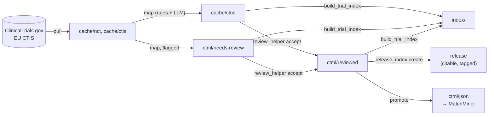

# nct2ctml (Kispi fork)

This is a fork of [sumedhasaxena/nct2ctml](https://github.com/sumedhasaxena/nct2ctml),
maintained by Kinderspital Zürich (Kispi) and retargeted from adult oncology in
Hong Kong to paediatric oncology worldwide. It pulls trial records from public
registries, maps their eligibility criteria to the Clinical Trial Markup
Language ([CTML](https://matchminer.gitbook.io/matchminer/deployment/ctml-and-trial-curation))
with a mix of deterministic rules and an LLM, routes the result through human
review, and builds a flat index that Kispi's genomics pipeline joins against
its samples.

CTML remains the curation and review format, and reviewed CTML is still
converted to `ctml/json`. The primary downstream consumer is no longer a
MatchMiner instance but the flat query index ([doc/index_guide.md](doc/index_guide.md)).

What differs from upstream, and why, is recorded in [CHANGES.md](CHANGES.md).
Upstream is Copyright 2026 The University of Hong Kong under Apache-2.0;
modified files carry a notice at the top.

## Quickstart

Python 3.12 or newer. Mapping calls Claude through the Anthropic API, so it
needs a key; pulling and building the index do not.

```bash
git clone https://github.com/lgrob/nct2ctml.git && cd nct2ctml
python3.12 -m venv .venv && ./.venv/bin/pip install -r requirements.lock
source .venv/bin/activate
export ANTHROPIC_API_KEY=...                  # never in config.py

python main.py pull --nct_id NCT03643276      # one trial into cache/nct
python main.py map --nct_id NCT03643276       # CTML into cache/ctml, or ctml/needs-review if flagged
python -m utils.build_trial_index             # the flat index into index/
python -m unittest discover -s tests          # offline suite, no key needed
```

## How it works



Every mapped file records what produced it, and every model call is kept
under `runs/` ([doc/provenance.md](doc/provenance.md)). `index/` is a working
copy; a report cites a release ([doc/index_guide.md](doc/index_guide.md)).

## Installation

Python 3.12 or newer (`pyproject.toml`; tested on 3.12 and 3.13). Install
from `requirements.lock`, as in the quickstart: it pins every package at the
version the test suite was run with.

`requirements.txt` states only the minimum versions (the same as
`pyproject.toml`). Use it to try newer packages, not to reproduce a run.
After changing it, regenerate the lock as its header describes;
`tests/test_environment.py` fails while the three files disagree. Each run
records the Python and package versions it used in `runs/<run_id>/run.json`.

`anthropic` is needed only for the Anthropic backend; it is imported lazily,
so the self-hosted backends run without it.

## Sources

- **ClinicalTrials.gov** (`--source nct`, the default). Queried with a
  paediatric age filter; cached under `cache/nct`, with sync state in
  `cache/nct/trial_status.csv`.
- **EU CTIS**, the Clinical Trials Information System (`--source ctis`).
  Upstream does not cover it. Cached under `cache/ctis`, keyed on the EU CT
  number (e.g. `2025-522006-21-00`). Most CTIS trials have no
  ClinicalTrials.gov record.

`cache/` is gitignored; a fresh clone has no trial data until `pull` runs.

## Usage

Run the CLI from the project root. There are two subcommands, `pull` and
`map`; each requires exactly one of `--all`, `--nct_id` or `--ct_number`.

```bash
python main.py pull --all                          # ClinicalTrials.gov
python main.py pull --all --source ctis            # EU CTIS
python main.py pull --all --source all             # both registries
python main.py pull --nct_id NCT03997435           # one ClinicalTrials.gov trial
python main.py pull --ct_number 2025-522006-21-00  # one CTIS trial (implies --source ctis)

python main.py map --all                           # NCT trials updated within MAPPING_CUTOFF_DAYS
python main.py map --all --cutoff-days 14          # override the cutoff
python main.py map --all --source ctis             # every cached CTIS trial
python main.py map --all --source all              # both registries
python main.py map --all --out /tmp/scratch        # write somewhere other than cache/ctml
python main.py map --nct_id NCT03997435
python main.py map --ct_number 2025-522006-21-00

python main.py promote [--dry-run]                 # reviewed CTML to ctml/json for MatchMiner
```

`pull --source` and `map --source` both accept `nct`, `ctis` or `all`;
`map --source` applies only with `--all`. `--cutoff-days` applies only to
`map --all` and overrides `MAPPING_CUTOFF_DAYS` in `config.py` (default 1),
selecting trials by `entry_last_updated_date` in `trial_status.csv`.
`map` writes to `CTML_MAPPED_PATH` in `config.py` (`cache/ctml`) unless `--out`
is given. `map --test_mode` writes to `cache/ctml_test/<date>_<model>`, so
development runs neither overwrite each other nor reach the index.

`map --all` skips trials with no oncology term in their conditions, keywords or
titles (`utils/oncology_scope.py`; `config.SKIP_OUT_OF_SCOPE_AT_MAP`). They
are still pulled and cached. The skipped trials and the reason for each are
listed in `ctml/out-of-scope.tsv`, which `python -m utils.oncology_scope`
regenerates without mapping; a per-trial decision in `ref/scope_overrides.tsv`
wins in either direction. Mapping one trial by id never skips.

`sync_trials.sh` runs `pull --all`, `map --all` and the index build once, for
both registries (`SOURCE=nct ./sync_trials.sh` for one). It uses
`./.venv/bin/python` unless `PYTHON` names another interpreter, and does not
create or update the environment. It stops at the first failing step and runs
only one sync at a time: a second one started while the first is running
exits with status 75 (the lock is `cache/sync.lock`, and a lock left behind by
a killed run is taken over). It can be started from any directory, as cron
does.

`ref/local_trial_info.csv` is currently header-only. It is the only route by
which a closed trial is pulled, so while it is empty no closed trials are.

## Workflow

For registry trials:

1. `pull` caches the records under `cache/nct` or `cache/ctis`.
2. `map` writes CTML (YAML) to `cache/ctml/`.
3. A curator checks the diagnosis and match criteria and accepts the trial
   with `python -m utils.review_helper accept <trial> --reviewer <name>`,
   which moves it to `ctml/reviewed/` and logs it
   ([doc/review_guide.md](doc/review_guide.md)). Unreviewed trials are in the flat index, marked
   `reviewed = 0`; a hit on one is a lead for a curator, not a finding.
4. `python main.py promote` converts `ctml/reviewed` to `ctml/json`, the
   queue `matchminer-admin` loads into MatchMiner (pass trial ids to convert
   only those, `--dry-run` to list without writing). It used to be
   `bulk_convert_yaml_to_json.py`. The `_provenance` block is left out of the
   JSON, because MatchMiner rejects unknown fields.

A trial is written to `ctml/needs-review/` (`config.CTML_REVIEW_PATH`) instead
of `cache/ctml/`, for both registries, when a check flags it. For example, when the mapper could determine no
Oncotree diagnosis at all (as it stands it would match every patient), or when
a protein change failed its reference check (the criterion is gene-level until
a curator resolves it; the stated value is kept as
`protein_change_unverified`), or when the model returned a gene the criteria
text does not support (`gene_unsupported`; see `trial_genomic.tsv`'s
`gene_check`), or when a diagnosis was answered outside the candidate list the
model was offered (`diagnosis_off_list`). It is held back but not discarded, because a
trial that is absent is one nobody can see is missing.

For local trials not in any registry, a CTML file is written by hand into
`ctml/pending/`, checked, and moved to `ctml/reviewed/`; see
[doc/trial_creation_guide.md](doc/trial_creation_guide.md). The two queues are
kept apart deliberately: `ctml/needs-review` is machine output awaiting a fix,
`ctml/pending` is a colleague's draft awaiting a check.

Mapping details are in [doc/nct_to_ctml_mapping_guide.md](doc/nct_to_ctml_mapping_guide.md).

## Documentation

| Topic | Where |
|---|---|
| Reviewing flagged trials, accepting and excluding | [doc/review_guide.md](doc/review_guide.md) |
| The flat index: tables, columns, releases | [doc/index_guide.md](doc/index_guide.md) |
| How criteria are mapped | [doc/nct_to_ctml_mapping_guide.md](doc/nct_to_ctml_mapping_guide.md) |
| Writing CTML by hand for a local trial | [doc/trial_creation_guide.md](doc/trial_creation_guide.md) |
| Provenance, recorded model calls, replay | [doc/provenance.md](doc/provenance.md) |
| LLM backends; Ollama on a GPU cluster | [doc/llm_backends.md](doc/llm_backends.md), [doc/cluster_setup.md](doc/cluster_setup.md) |
| Reference data in `ref/` | [doc/reference_data.md](doc/reference_data.md) |
| Benchmark against the curated trials | [bench/README.md](bench/README.md) |
| Tests, linting, measurements, upstream merges | [CONTRIBUTING.md](CONTRIBUTING.md) |
| Known problems; what is planned | [doc/open_issues.md](doc/open_issues.md), [doc/roadmap.md](doc/roadmap.md) |
| What changed and why | [CHANGES.md](CHANGES.md), [doc/changelog.md](doc/changelog.md), [doc/decisions/](doc/decisions/), [doc/runs/](doc/runs/) |

## Known limitations

Open correctness issues, unmeasured guesses and upstream assumptions still
carried are listed in [doc/open_issues.md](doc/open_issues.md).

## Citation

If you use this fork, cite the paper that describes the method, and name the
fork and the version or commit you ran (`CITATION.cff`; GitHub's "Cite this
repository" offers both):

Sumedha Saxena, Edmond S K Ma, Aya El Helali, David J H Shih. AI-assisted patient matching for
personalized cancer medicine. Briefings in Bioinformatics.
2025;26(Supplement_1):i12–i14. https://doi.org/10.1093/bib/bbaf631.013

```bibtex
@article{saxena2025nct2ctml,
  title   = {AI-assisted patient matching for personalized cancer medicine},
  author  = {Saxena, Sumedha and Ma, Edmond S K and El Helali, Aya and Shih, David J H},
  journal = {Briefings in Bioinformatics},
  volume  = {26},
  number  = {Supplement_1},
  pages   = {i12--i14},
  year    = {2025},
  doi     = {10.1093/bib/bbaf631.013},
  url     = {https://academic.oup.com/bib/article/26/Supplement_1/i12/8378037}
}
```

## License

This project's source code is licensed under the Apache License 2.0.
See [LICENSE](LICENSE). Modifications are described in [CHANGES.md](CHANGES.md).

## Resources

- [ClinicalTrials.gov API](https://clinicaltrials.gov/data-api/api#extapi)
- [EU Clinical Trials Information System](https://euclinicaltrials.eu/)
- [MatchMiner CTML](https://matchminer.gitbook.io/matchminer/deployment/ctml-and-trial-curation)
- [Oncotree (oncotree_2025_10_03)](https://oncotree.mskcc.org/?version=oncotree_2025_10_03&field=NAME)
- [Manual CTML curation guide](doc/trial_creation_guide.md)
